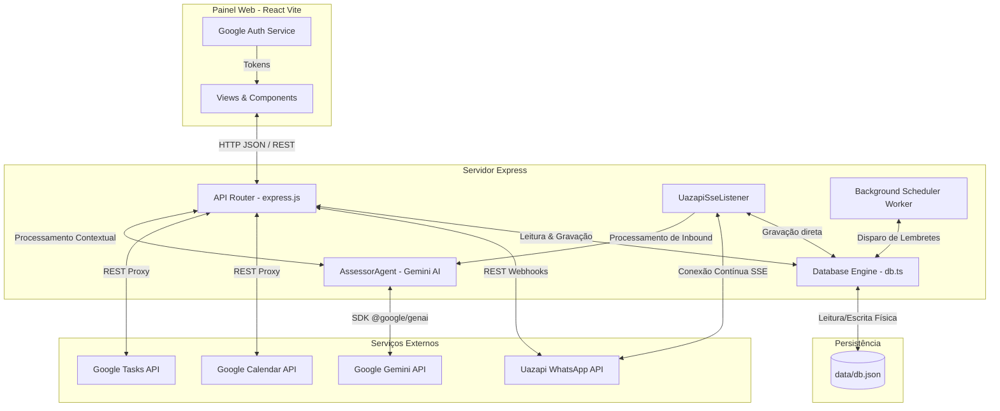
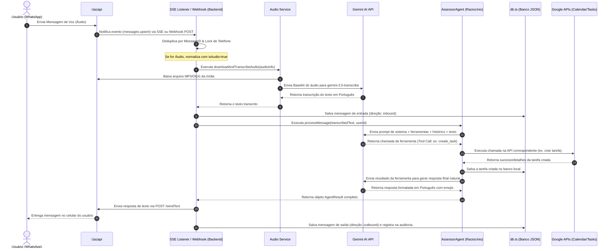
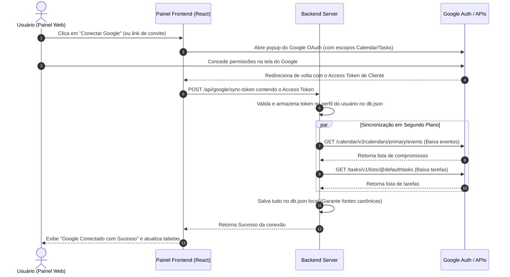
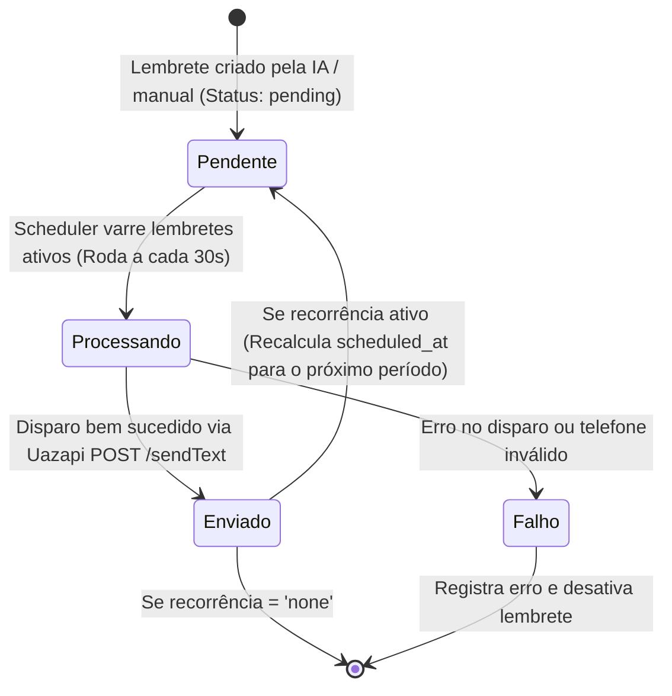

# URSO JR. — Seu estagiário com IA
## 02-ARCHITECTURE.md — Arquitetura Real e Fluxos de Dados

Este documento mapeia a arquitetura técnica real da aplicação, descrevendo como os dados trafegam e como as integrações estão conectadas.

---

### 1. Visão Geral da Arquitetura Geral

O URSO JR. é um aplicativo full-stack em que o frontend (Vite React SPA) e o backend (Express) coabitam na mesma porta no ambiente de desenvolvimento, facilitando o gerenciamento do faturamento, rotas e APIs.

#### Diagrama A: Arquitetura Geral do Sistema

---

### 2. Fluxo Principal: Mensagem de Voz/Texto do WhatsApp → Resposta do Agente

Quando o usuário envia uma mensagem de áudio ou texto para o WhatsApp do robô, o fluxo segue rigorosamente esta esteira:

#### Diagrama B: Fluxo de Entrada de Mensagem e Resposta

---

### 3. Integração Google Workspace (OAuth & Sincronização)

O fluxo de sincronização e autorização do Google é desenhado para operar de forma puramente cliente-servidor nativa, evitando segredos de cliente expostos no backend.

#### Diagrama C: Fluxo de Conexão Google OAuth e Sincronização

---

### 4. Ciclo de Vida do Lembrete Automático

Os lembretes cadastrados pela IA ou manualmente possuem uma máquina de estados simples executada por Cron no servidor.

#### Diagrama D: Ciclo de Lembrete do WhatsApp

---

### 5. Estrutura Técnica dos Serviços e Componentes (Código Real)

*   **DATABASE ENGINE (`/server/db.ts`):** O repositório central. Todas as leituras e gravações passam pela instância única `db`. Ele faz caching em memória e sincronização via arquivo físico `data/db.json` de forma robusta e persistente.
*   **WHATSAPP LISTENER & WEBHOOK (`/server/services/uazapi-listener.ts`):** Executa o fluxo de SSE contínuo e expõe o barramento de entrada para as rotas do webhook. Centraliza o controle de concorrência e deduplicação de mensagens duplicadas por rajadas de rede.
*   **ASSESSOR DE IA (`/server/agent.ts`):** O cérebro do robô. Gerencia prompts dinâmicos injetando memórias do usuário em tempo real. Implementa um algoritmo heurístico para interpretação temporal de linguagem natural brasileira (ex: "segunda 15h", "amanhã", "depois do almoço"), garantindo acertos operacionais de fuso horário.
*   **GOOGLE API SERVICES (`/server/google/`):** Pacotes de chamadas REST diretas para o Google Calendar e Google Tasks. Atuam como proxies autenticados usando os Access Tokens injetados dinamicamente de cada perfil.
*   **SCHEDULER JOB (`/server/scheduler.ts`):** Um agendador contínuo baseado em `setInterval` de 30 segundos, que executa tanto o disparo de lembretes quanto as tarefas recorrentes e o disparo de briefings matinais.
